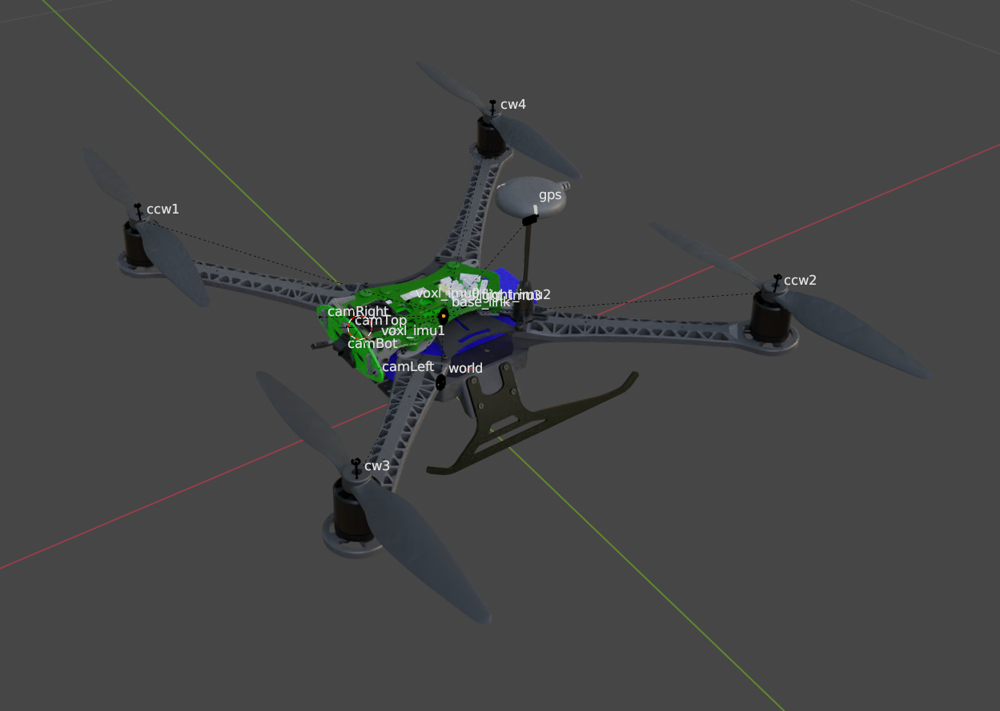

# Drone Dev Kit

This repository contains CAD files for various drone development kits. 
Included in this collection is a FreeCAD and Blender project file that allows you to:

- Visualize the complete assembly of the drone.
- Explore the drone structure allowing the removal or addition of parts to the assembly.
- Customize the drone or any of its parts.

## Contents

### [ModalAI VOXL-m500](./voxl-m500)

The ModalAI VOXL-m500 in this repository is crafted with components from various sources. Following is a breakdown of its key parts:

- VOXL-Flight Deck Model: The flight deck model is sourced from [ModalAI's asset repository](https://developer.modalai.com/asset/6).
- Drone Frame: The frame of the drone is based on the HolyBro S500 model, available at [HolyBro's Wikifactory](https://wikifactory.com/+holybro/reference-frame-1/files) page.
- Landing Skid: The landing skid is adapted from the Sentinel Drone Step File, accessible through [ModalAI's Sentinel Functional Description](https://docs.modalai.com/sentinel-functional-description/#3d-step).
- Propellers: The propellers for the VOXL-m500 have a diameter of 10 inches and a pitch of 45 inches. You can obtain the propeller model from [Grabcad](https://grabcad.com/library/propeller-10x45-1).

| Drone                                                              | FreeCAD                                                                       | Blender
|-----------------------------------------------------------------------|-------------------------------------------------------------------------------|---------
| |  |  |

- File format includes **.step**, **.stl**, **.urdf + .dae** 